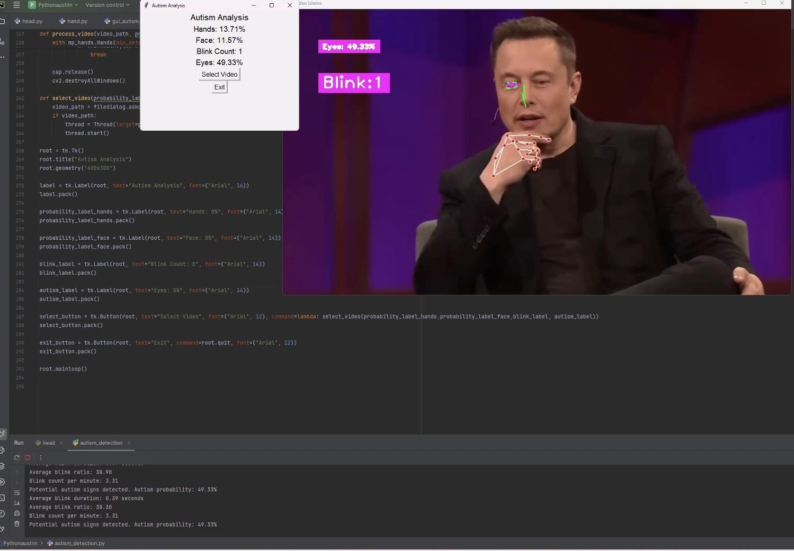
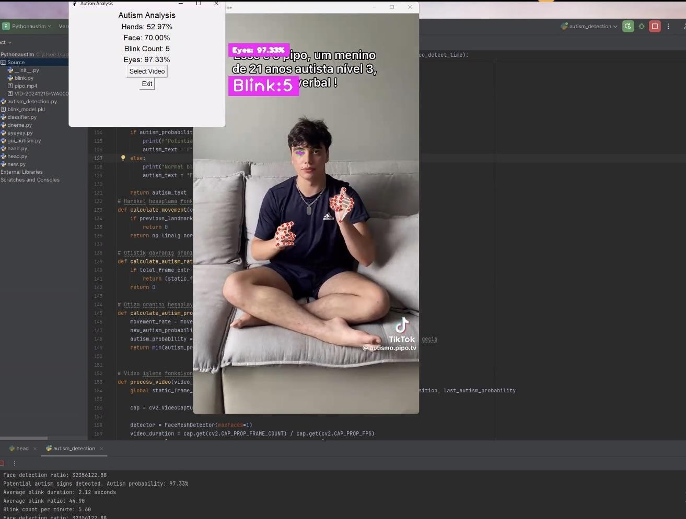
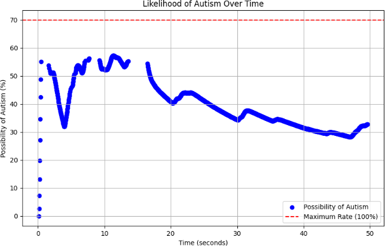
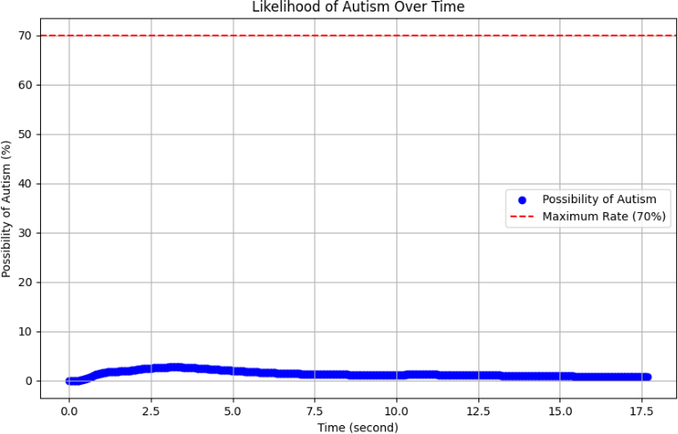
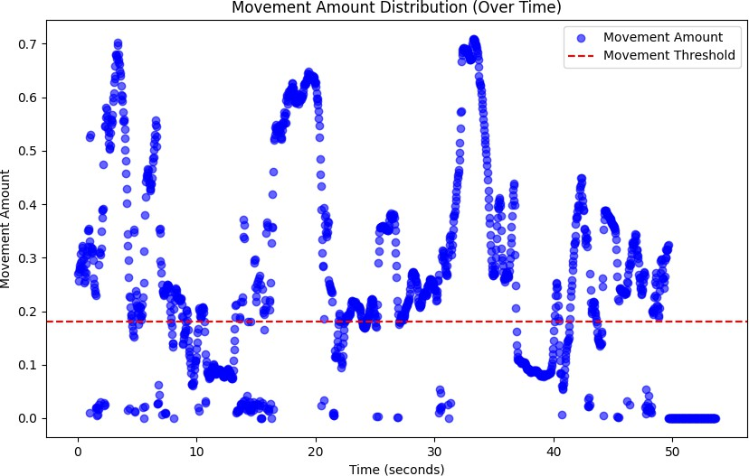
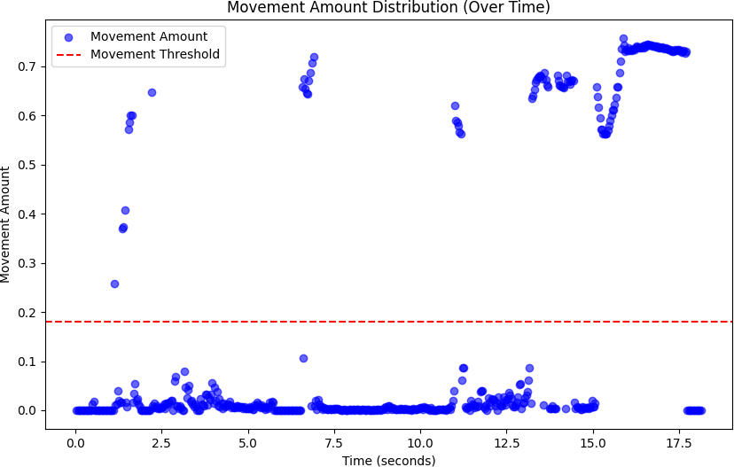
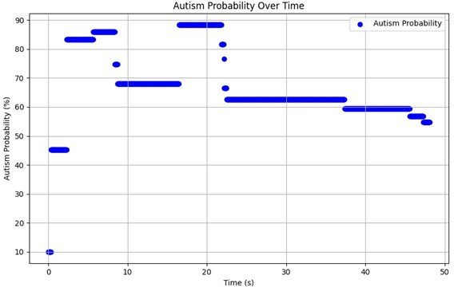
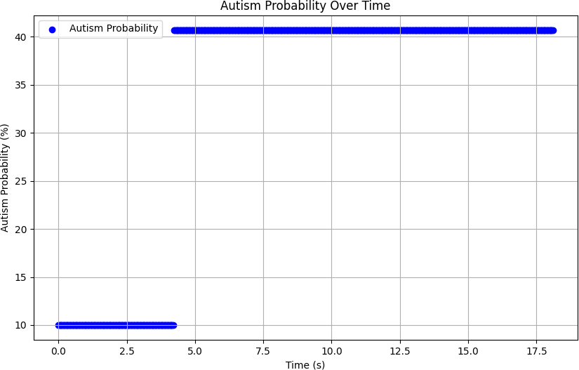

# Detecting Autistic Behaviors via Video Analysis

## 👩🏼‍💻👩🏻‍💻👩🏽‍💻 Developed By
- [Sude Güzel (me)](https://github.com/sdgzl)
- [Merve Saltık](https://github.com/mervesaltik)
- [Aleyna Menekşe](https://github.com/Aleynamnks)  

This project aims to detect autistic behaviors through video analysis by identifying subtle body language and facial expressions using computer vision and machine learning techniques. It provides a non-invasive, efficient, and user-friendly tool that can assist in the early diagnosis and monitoring of Autism Spectrum Disorder (ASD).

## 🧠 Project Summary

Autism is characterized by distinctive behavioral patterns, often hard to detect through traditional observation. This project introduces a video-based system that processes uploaded videos to identify autism-related behaviors such as:

- **Blinking frequency**
- **Repetitive hand movements**
- **Sudden nose gestures**

The system utilizes **OpenCV** for image processing and **Tkinter** to provide an interactive GUI for users to upload videos and visualize behavior statistics.

## 📌 Features

- 🎯 **Autism Likelihood Scoring** based on behavioral analysis
- 📊 **Statistical Breakdown** of behavior frequency, duration, and consistency
- 🤖 **Custom Detection Algorithms** tailored to ASD indicators
- 🎥 **Video Upload Interface** through a clean and intuitive GUI
- 📈 **Scatter Plot Visualizations** for key behavioral regions (eye, hand, head)

## 🛠️ Technologies Used

- Python  
- OpenCV  
- Tkinter  
- Haar Cascade Classifier  
- Matplotlib  
- Custom behavior detection algorithms

## 🧮 System Model & Methodology

1. **Video Upload & Preprocessing**  
   - Extract frames, convert to grayscale  
   - Normalize for consistent analysis  

2. **Face Detection & Behavior Tracking**  
   - Uses Haar Cascades for robust facial detection  
   - Tracks motion patterns across frames  

3. **Behavioral Analysis**  
   - Calculates blinking frequency, gesture repetition, and nose movements  
   - Applies a weighted scoring function to assess autism likelihood  

4. **Visualization & Output**  
   - Displays autism likelihood as a percentage  
   - Shows scatter plots for autistic vs. non-autistic behavior  

## 💡 Results (Normal vs Autistic Behavior)
- **Person without Autism:**
  

- **Person with Autism:**
- 

## 🔍 Comparison with Other Studies

Unlike many clinical or dataset-only models, this project:
- Works with **user-uploaded videos**
- Provides **real-time behavior detection**
- Offers a **personalized, accessible experience**  
- Bridges clinical insight with practical home use  

## 📸 Scatter Plots

> *Scatter plots comparing eye, hand, and head movements of autistic and non-autistic individuals. *

- **Scatter Plot for the HEAD of an autistic person:**
  

- **Scatter Plot for the HEAD of an non-autistic person:**
  

- **Scatter Plot for the HAND of an autistic person:**
  

- **Scatter Plot for the HAND of an non-autistic person:**
  

- **Scatter Plot for the EYE of an autistic person:**
  

- **Scatter Plot for the EYE of an non-autistic person:**
  

---

**Software Engineering Department**

---

